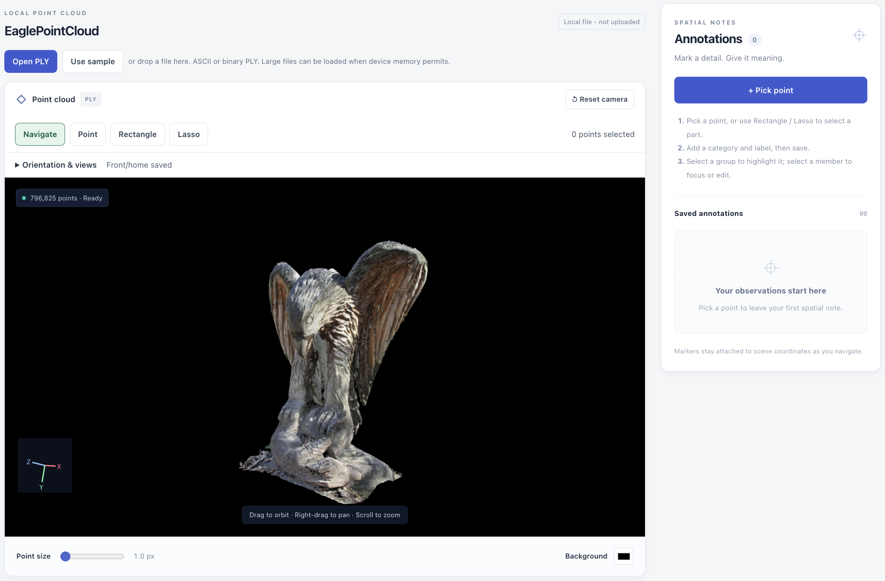

# Neural 3D Data Viewer



An interactive 3D point-cloud dashboard for **DS 7400 Deep Learning HW1**. 

Load a colored PLY point cloud, orbit and reorient it, then turn individual points or
whole regions into saved spatial annotations. The viewer, the annotation
workflow and the FastAPI/SQLite backend are all **implemented**.

## Visualization data: colored PLY point clouds

- **Bundled synthetic sample — Spectrum Garden.** `spectrum-garden.ply`, ASCII
  PLY, **6,453 colored points** (253,573 bytes), generated entirely from
  analytic grids by [`scripts/generate_sample.py`](scripts/generate_sample.py).
- **Your own files.** **ASCII**, **binary little-endian** and **binary
  big-endian** PLY are all supported. Vertex colors are used when present;
  otherwise points render in a light-blue fallback color.
- **Mesh PLY.** Each original vertex is displayed once as a point and **faces
  are ignored** (the app reports both counts). This is a point-cloud viewer,
  not a surface renderer.
- **Locally opened PLY bytes stay in the browser and are never uploaded to or
  stored on the backend.** Only scene metadata and annotations reach the API;
  the badge **Local file - not uploaded** marks this mode.
- **Optional manual test data.** [`sample-data/`](sample-data/README.md) holds
  two unmodified Open3D PLY files — `EaglePointCloud.ply` (796,825 colored
  points) and `fragment.ply` (196,133 colored points) — for larger real scans.
  They are **not part of the frontend build** and are never served by the app;
  open them with **Open PLY** or drag and drop.

## Implemented features

- Direct Three.js point rendering with vertex colors or a fallback color, plus
  adjustable point size and background.
- Orbit, pan, zoom, arbitrary roll, X/Y/Z up choices, a saved upright/front home
  view, six presets (Front/Back/Left/Right/Top/Bottom), and automatic camera
  fitting on load, reset and resize.
- **Open PLY** picker and drag-and-drop, with **Use sample** to return to
  Spectrum Garden. A failed import leaves the previous valid scene intact.
- Loading/ready/empty/error states and scene metadata: name, filename, point
  count, file size, PLY encoding, ignored face count, color source and bounds.
- Scenes are keyed by a SHA-256 fingerprint of the exact file bytes, so notes
  follow the file, not its name. Responsive layout; markers use numbers, labels
  and outlines, not color alone.

### Annotation — implemented

- **Point:** click near a vertex to place a numbered landmark marker.
- **Rectangle** and **Lasso:** drag an outline to select a region; one region is
  one record, however many points it covers.
- **Replace / Add / Subtract** operations (also Shift and Alt/Option), with a live preview and a cancellable calculation.
- Category, label and optional note, with full create/read/update/delete. Point
  and region records share case-insensitive category + label groups, with
  expand/collapse, highlighting and exact point focus.
- **Select-through:** Rectangle and Lasso include every point projected inside
  the outline, **including points hidden behind others** — not
  visible-surface-only selection.

### Backend/database — implemented

**FastAPI + SQLite** provide health, scene metadata and complete annotation CRUD,
and a **Database connected** badge shows the live mode. If the API is unreachable
the app falls back to a clearly labeled **Local demo mode** backed by
`localStorage`, so viewing and annotating still work without a server.

## Technology

- **Frontend:** React 19, Vite 7, TypeScript, **Three.js** (`PLYLoader`,
`OrbitControls`), Web Crypto SHA-256, a Web Worker for PLY parsing.
- **Backend:** **FastAPI**, Pydantic v2, **SQLAlchemy 2**, **SQLite**, Uvicorn.
- **Checks:** ESLint, TypeScript, Playwright, pytest; npm and pip lockfiles.

## Run from a clean environment

Requirements: **Node.js 22.13+**, npm, **Python 3.12+**, a **WebGL2** browser.
Commands start at the repository root; no credentials, GPU or dataset needed.

### Terminal 1: backend

```bash
python3.12 -m venv backend/.venv
source backend/.venv/bin/activate
python -m pip install -r backend/requirements-dev.txt
cd backend
python -m uvicorn app.main:app --reload --host 127.0.0.1 --port 8000
```

Name the 3.12+ interpreter explicitly; a bare `python3` may be an older Python
that cannot install these lockfiles. Health check
<http://127.0.0.1:8000/api/health>; SQLite lands in `backend/data/` (Git-ignored).

### Terminal 2: frontend

```bash
cd frontend
npm ci
npm run dev
```

Open <http://127.0.0.1:5173>. Vite proxies `/api` to 8000, so start the backend
first to see **Database connected**.

### Docker Compose

```bash
docker compose up --build
```

Open <http://localhost:8080>: nginx serves the built frontend and proxies
`/api`, and SQLite persists in the `annotations` named volume.

## Verification

Stop any dev servers first: the browser tests start their own API and Vite
instances on a temporary database.

```bash
source backend/.venv/bin/activate
python scripts/generate_sample.py --check
python -m pytest -q backend
python scripts/smoke_backend.py
cd frontend
npm run lint
npm run build
npx playwright install chromium
HW1_PYTHON="$(command -v python)" npm run test:browser
cd .. && python scripts/export_public.py --dry-run
```

Playwright needs an OS with its browser runtime dependencies, and
`node scripts/smoke_static.mjs` checks a backend-less production build.

## Future directions — TBD

The page's **Future Modules — TBD** cards are informational only. **None of
these is implemented** in this HW1 release: 3D Gaussian Splat viewing
(Spark.js), point cloud to 3DGS training, COLMAP multiview reconstruction. There
is no deep-learning pipeline, GPU computation, authentication or cloud
deployment; streaming, LOD and visible-surface-only selection remain TBD.

## License

**This project** — its own code and the synthetic Spectrum Garden sample — is
released under the **MIT License**: [`LICENSE`](LICENSE).

**Third-party data** is licensed separately: the two PLY files in
`sample-data/` are unmodified redistributions from the Open3D project,
© 2018-2023 www.open3d.org, under the **Open3D MIT License**
([`sample-data/LICENSE`](sample-data/LICENSE)), with source links in
[`sample-data/README.md`](sample-data/README.md). Three.js, React, Vite,
FastAPI, SQLAlchemy and other dependencies come from their own published
packages under their own licenses; no third-party source is vendored here.
